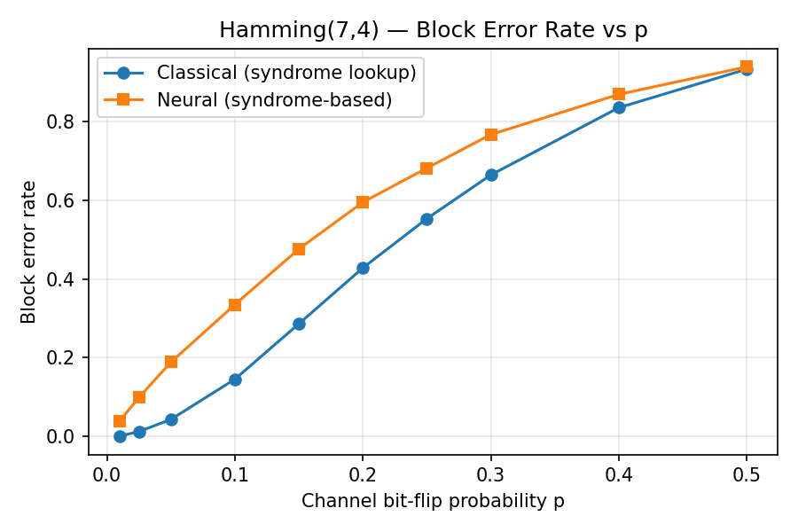
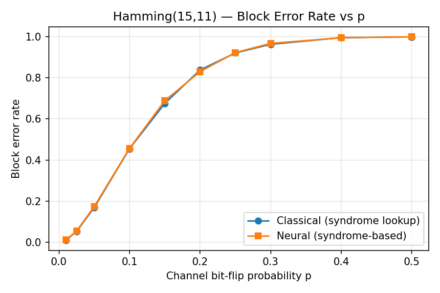
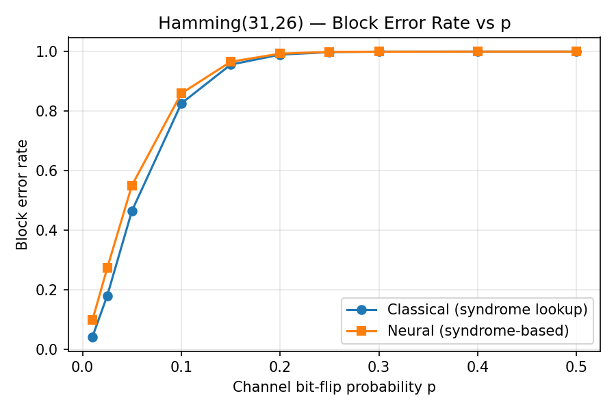
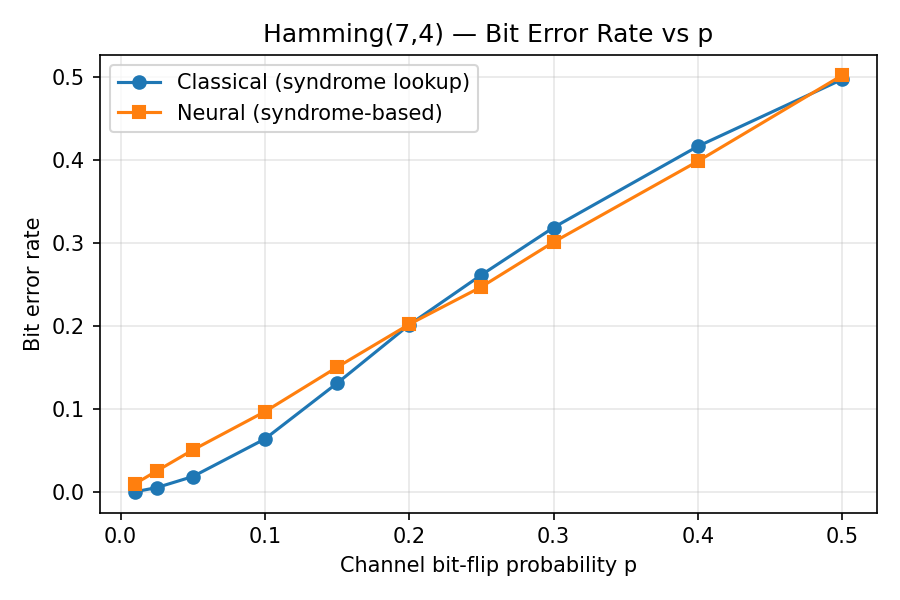
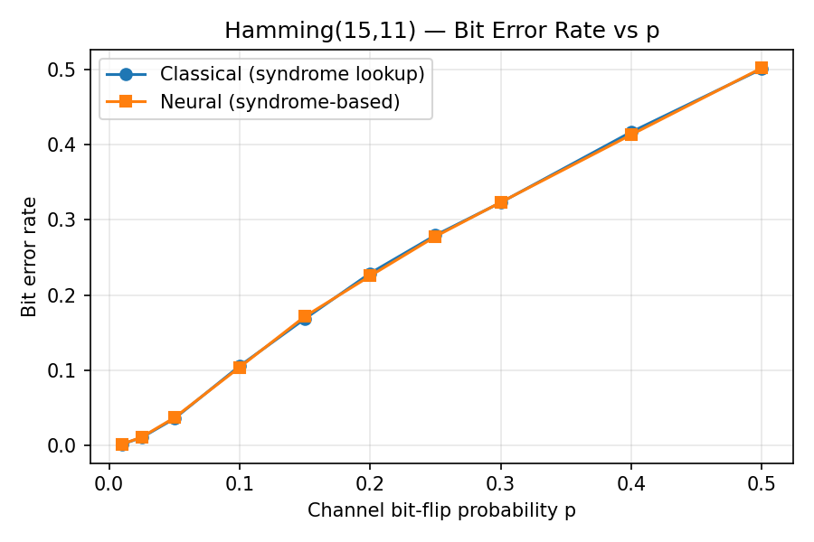
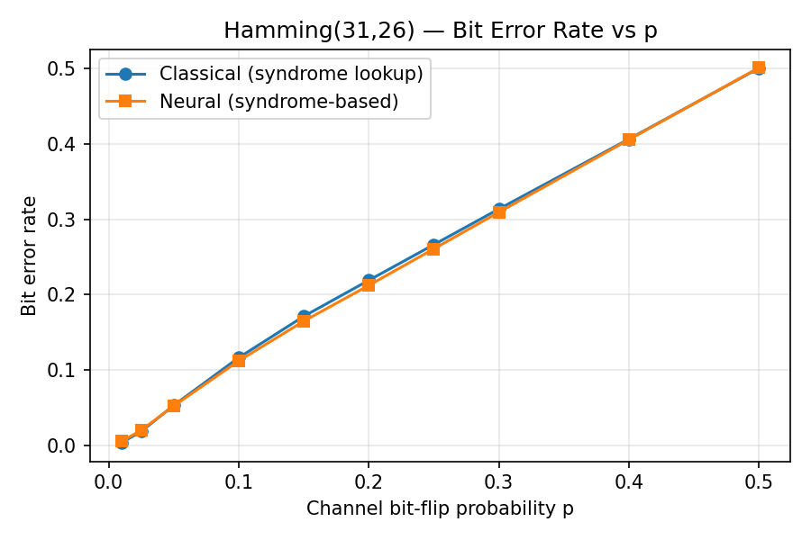

# General Hamming Codes and a Neural Decoder in C++

## Overview

A general-r Hamming($2^r - 1$,k) implementation with classical decoding, compared against a from-scratch neural decoder (trained with a syndrome approach - more below). This gives a chance to compare two different approaches to the decoding problem - one deterministic and one random. Both approaches were built in pure C++ to demonstrate understanding of the underlying mechanics, and were both tested using the same Monte Carlo simulation over a binary symmetric channel. 

## Project Structure
```
ecc-sim/
├── src/
│   ├── bit_vector.h
│   ├── bit_matrix.h
│   ├── hamming_code.h
│   ├── channel.h
│   ├── rng.h
│   ├── neural_decoder.h
│   ├── neural_training.h
│   ├── neural_eval.h
│   ├── ber_eval.h
│   ├── csv_export.h
│   └── main.cpp
├── tests/
│   ├── test_utils.h
│   ├── test_hamming.h
│   └── main_tests.cpp
├── scripts/
│   └── plot_results.py
├── results/
│   ├── classical_r3.csv
│   ├── neural_r3.csv
│   └── ...
├── CMakeLists.txt
└── README.md
```
## Building and Running

On a unix system:
In `ecc-sim/build/`: `cmake .. && make && ./Ecc_Sim` 
To test: `ctest --output-on-failure`

## Hamming Code Implementation

Most of the implementation is built around the number of parity bits, $r$, being the natural generating parameter - we can then derive the codeword length $n=2^r - 1$ and message length $k=n-r$ easily. Note that $r$ is also the length of the syndrome. $r$ was a natural choice as any $r$ would generate a valid Hamming code - this is not true for $k$ and $n$ - this allows us to avoid having to check if the generating parameter was valid each time.

For the generator matrix $G$, systematic form was chosen ($G=[I_{k}|P]$) for much easier extraction of the decoded message (the message would be the first $k$ bits of the codeword). For syndrome decoding, the below equation was integral:

$$
H \cdot \text{received} = H \cdot c + H \cdot e_{i} = 0 + H \cdot e_{i} = \text{column i of H}
$$

The result $H\cdot \text{received}$ should give directly the position of the error, but as $G$ is in systematic form the lookup array `bitMap` was used to find the error position. (Note: this theory is called Syndrome decoding in Coding theory - it is used again in the neural decoder section).

Dimensions of the matrices (and neural networks!) were compile-time template parameters, enabling codewords (`bitVector`s) to be stored as `std::bitset` , and dimension mismatches (which happened frequently) to be caught at compile-time.
## Testing

A small test harness was written post most of the Hamming code implementation to test the underlying machinery. The identity $H\cdot G^T=0$, a zero bit flip, and a one bit flip was tested in $r=3,4,5$. Writing a fresh small test harness was preferred over using a pre-written test framework as the size of the test framework (like `catch2`) would dwarf the size of the full project and would be mainly unnecessary.

## Neural Decoder

The obvious approach would be to train a network to map a received codeword directly to a message. This is problematic as it is an approach that overfits badly, since the number of valid codewords grows exponentially with block length and a network can never see more than a tiny fraction during training - this project follows the syndrome-based approach of Bennatan, Choukroun & Kisilev (2018). The network is instead trained to map a syndrome to the underlying error pattern. 

The network built was a single hidden-layer feedforward network (written in pure C++), with the r-bit syndrome as input and the predicted n-bit error pattern as output. Loss was binary cross-entropy, and trained with single examples. One hidden layer was sufficient - the input space is small ($2^r$ possible syndromes) - no need for a deeper architecture. Networks used hidden sizes of 20/30/50 for r=3/4/5, learning rate 0.01, trained for 100,000 iterations.

Initial training used a corruption probability (per bit) of $p=0.1$ to generate examples to train. This caused the loss to plateau almost immediately - $p=0.1$ was too high for the network to learn the unambiguous single-error cases. At $p=0.05$, loss dropped and the networks were capable of generalising over the full evaluation range. 

## Channel Simulation and BER Evaluation

Both methods were evaluated over the same binary symmetric channel simulation - each bit of transmitted data had a set probability of flipping (outlined in `channel::corrupt`).

Performance was measured via a Monte Carlo simulation - 10,000 trials for each p-value (random message -> encode -> corrupt/simulate channel -> decode -> compare to original). The bit error rate (BER) and block error rate (BLER) were computed from the results. Earlier runs used only 1000 trials, but resulting calculated rates differed too much from the expected rates at low p-values.

## Results

Full data: `results/`









Across all three code sizes, the neural decoder tracks the classical decoder within a fraction of a percent at every tested value of $p$ — for both bit and block error rate. This holds even in the high-$p$ cases dominated by multi-bit errors, where the classical decoder's single-error-correction guarantee no longer applies and there is no unique correct answer, and despite the neural decoders being trained at a single, lower noise level ($p=0.05$) than most of the evaluation range. This suggests the learned mapping generalises beyond its training distribution rather than merely memorising it.

## Next Steps

The original motivation for this project was to compare implementations and effectiveness of Hamming Codes and Reed-Solomon codes, however the project and scope was adapted when I discovered neural decoders, and thought comparison with that would be more interesting. However RS codes are more effective than Hamming codes, so that would be a logical next step for the project. 

Another improvement would be to implement another, more realistic, channel simulation. A binary symmetric simulation (with a constant $p$) probably fails to imitate most physical channels that data is sent across - something like an Additive White Gaussian Noise (AWGN) is used more frequently in actual papers but was much more complicated to implement.

## References

1. A. Bennatan, Y. Choukroun, P. Kisilev, "Deep Learning for Decoding of Linear Codes - A Syndrome-Based Approach," 2018. [arXiv:1802.04741](https://arxiv.org/abs/1802.04741)

